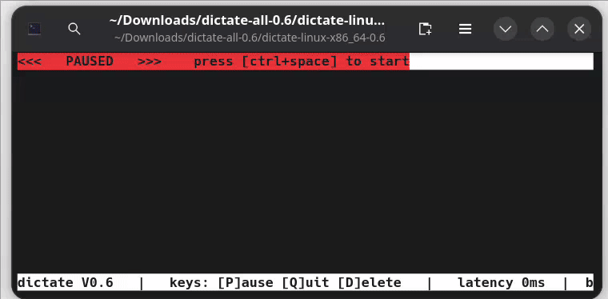
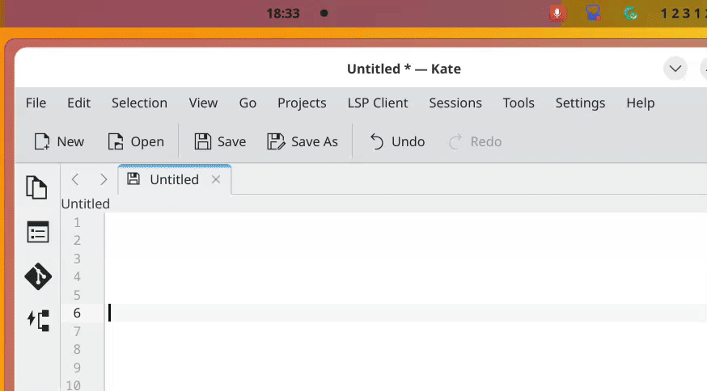

# Dictate

[](https://ai-declaration.md)

A small TUI and systray Go program that does real-time speech-to-text from your microphone. It uses [whisper.cpp](https://github.com/ggerganov/whisper.cpp) under the hood for the actual inference, so all transcription happens locally.

In terminal:


In systray:


## Usage

Install from the releases page.

Make sure your microphone is connected, then run:

```bash
./dictate
```

The first time you run it, the required Whisper model will be downloaded automatically.  Available models are these:
https://huggingface.co/ggerganov/whisper.cpp/tree/main

If you do not have a GPU, use `--quality-preset low` option and it will use a small, fast model.
If you have any GPU, even an
old one, you should be able to use ``--quality-preset medium`` and still get reasonable performance. (Latency may be a bit worse.)
Newer GPUs should be able to use `--quality-preset high` and still have reasonable latency.

**See ``--help`` for complete control over model selection and other options.**  Options can also be set
in file `~/.config/low_latency_dictation/config.yaml`.

A numbered list of audio devices will be printed on startup.  If the wrong one
is used you can change it with `--audio-device` option.

To begin dictating, tap the _global hotkey_, by default **ctrl+space**.  (If you prefer to begin immediately, use `--skip-pause-mode`)

A lower quality model will be used to display your dictation in real time.  When you have finished, tap the hotkey again to finalize.
Your dictation will then be processed by a higher quality model, copied to the clipboard, and pasted into the current window.

## Global Hotkey

The hotkey is configurable with `--hotkey-mods` and `--hotkey-key`, e.g.:

```bash
./dictate --hotkey-mods alt --hotkey-key f1
```

Accepted modifiers (joined by `+`): `ctrl`, `shift`, `alt`, and `cmd` (macOS) / `win` / `super` (the Windows/Command/Super key). Keys: `a`–`z`, `0`–`9`, `f1`–`f12`, `space`, `return`, `escape`, `delete`, `tab`, and the arrow keys.

`--hotkey-key ""` disables the hotkey.

### Linux

Needs uinput group permissions.  Enter this command then reboot:

    sudo usermod -aG uinput $USER

On Gnome, we recommend you install a [system tray](https://extensions.gnome.org/extension/615/appindicator-support/).
You can double-click the tray icon to start or to paste the transcription into the active window.
Right click for menu.

### Windows

You can drag the systray icon out of the systray menu to pin it to the taskbar.  Single click the tray icon to start dictation or to copy the transcription to the clipboard. (Paste is not automatic.) Right click for menu.

### macOS (experimental)

On macOS the hotkey requires the app to be trusted for **Accessibility** (Input Monitoring). Grant it the first time in *System Settings → Privacy & Security → Accessibility*. 


## Building

### Arch (CachyOS, Artix, etc) Linux

```bash
git clone https://github.com/electronstudio/low_latency_dictation.git
cd low_latency_dictation
makepkg -si
```

### Others

You need Go, a C compiler, SDL2, and the Vulkan headers.

This will build the vendored `whisper.cpp` libraries and produce a `dictate` binary.

```bash
sudo apt install -y build-essential cmake golang-go git libsdl2-dev libshaderc-dev glslc libvulkan-dev 
git clone https://github.com/electronstudio/low_latency_dictation.git
cd low_latency_dictation
git submodule update --init --recursive
make
sudo make install 
```


## License

This project is licensed under the GNU General Public License v3.0. See [LICENSE](LICENSE).

whisper.cpp is MIT licensed and copyright (c) Georgi Gerganov.
